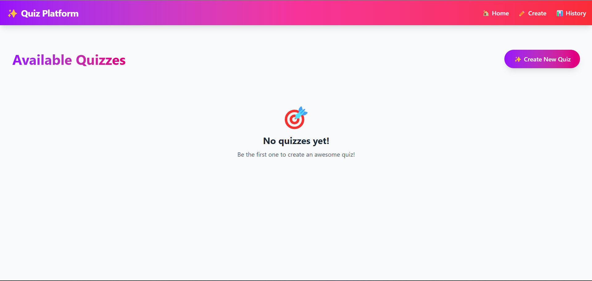

# Quiz Platform ✨




A modern quiz application built with React and Vite that allows users to create, take, and track quizzes with a Gen-Z inspired design.

🔗 [Live Demo](https://quiz-platform-blue.vercel.app/)

## Features 🚀

- **Create Quizzes**
 
  - Add multiple questions with dynamic options (2-6 options)
  - Set correct answers
  - Delete questions and options
  - Add quiz descriptions

- **Take Quizzes**


  - Interactive quiz interface
  - Immediate feedback
  - Score tracking

- **View History**

  - Track quiz attempts
  - View scores
  - Performance analytics

## Tech Stack 💻

- React 19
- Vite
- TailwindCSS
- React Router DOM
- React Icons
- IndexedDB (for local storage)

## Running Locally 🛠️

1. Clone the repository:

```bash
git clone https://github.com/yourusername/quiz-platform.git
cd quiz-platform
```
2. Install dependencies:

```bash
npm install
```
3. Start the development server:

```bash
npm run dev
```
## Project Structure 📁
quiz-platform/
├── src/
│ ├── components/ # Reusable components
│ ├── pages/ # Page components
│ ├── utils/ # Utility functions
│ ├── App.jsx # Main app component
│ └── main.jsx # Entry point
├── public/ # Static assets
└── index.html # HTML template


